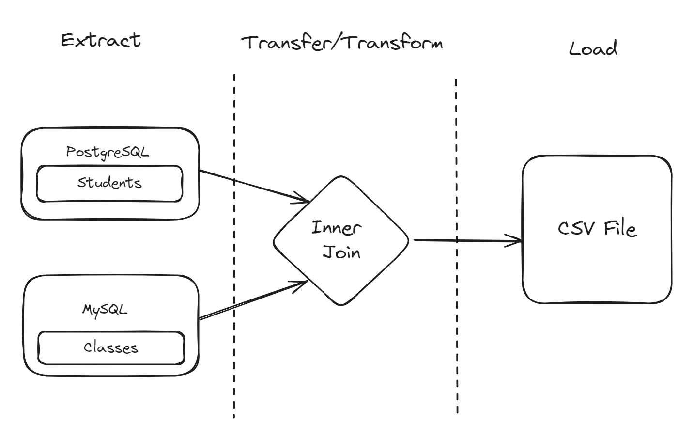
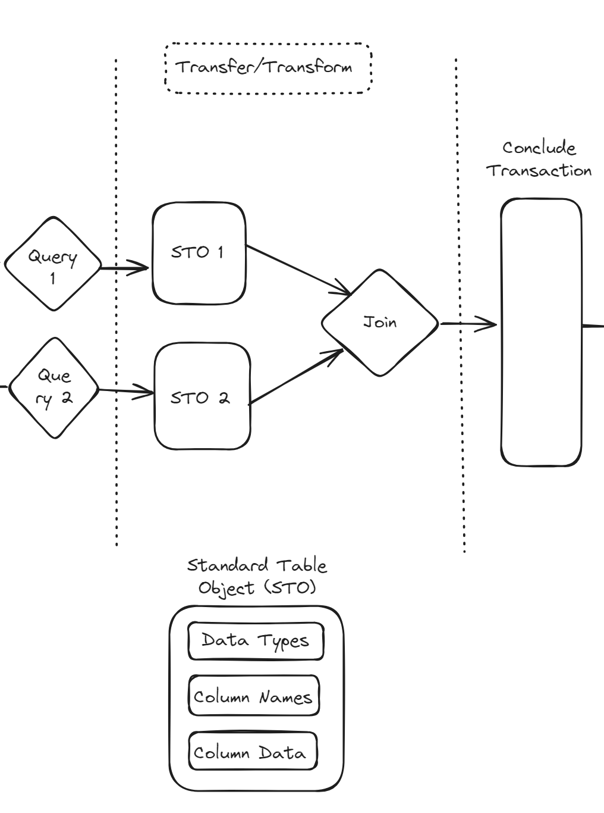

# Hack Day Project Title: InfaGo

### Are you tired of dealing with obscure error messages, disfunctional UI design and pesky bugs when doing seemingly simple integration tasks in IICS? So are we!
----------------------

Infago is an attempt to see what the life of an integration developer could look like if we moved away from IICS (Informatica Intelligent Cloud Services for folks at home) or never moved into it.

InfaGo is written in the Go programming language and leverages its built-in `database/sql` package to connect to different kinds of relational databases, including MySQL and Postgres (more on our attempt to get Oracle working later) 

What's included here is a very basic integration that takes from two different datastores, joins them together, and loads the result into a CSV file (as illustrated below). If you're familiar with IICS, you know that this should be a trivial task.

Initially, we hoped InfaGo would look like an SDK: a tool that developers could use to create there own "mappings" with. Our original intent for such looked something like this:

A key idea we wanted to implement proved to be significantly more challenging than we anticipated: specifically the Standard Table Object:

The idea behind the standard table object would be that every query or tranformation performed would yield one, representing the current column names, datatypes, and values stored. This would make it fast and easy for a developer to simply think about the sequence of transformations necessary for objects, rather than have to create another schema after almost every step.

Unfortunatly however, with Go's unique approach to OOP combined with our inexperience with the language, representing different column data types proved to be difficult for us (I'm sure someone smarter than us would be able to work through that). As a result, we resorted to using hard-coded schemas for this particular integration.

## What benefits would we expect if we moved toward "no-code-less" Data Integration?

## What challenges would arise if we leaned further into "no-code-less" Data Integration?